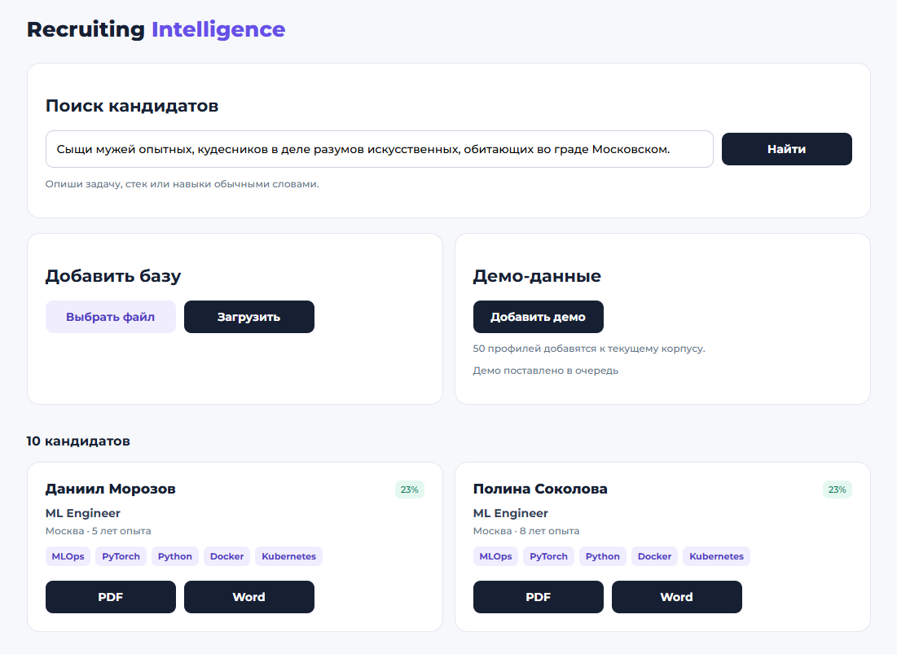

# GraphRAG Recruiting Intelligence

Evidence-first AI-система для поиска, анализа, ранжирования и подбора команд по заранее
загруженному корпусу кандидатов. Система не выполняет live-поиск через LinkedIn, HH.ru или
другие recruitment-платформы.

LLM отвечает за structured extraction, parsing intent, reranking и формулировку ответа.
PostgreSQL, pgvector и Neo4j остаются единственными источниками фактов о кандидатах.

## Возможности

- FastAPI, async SQLAlchemy 2, Alembic и PostgreSQL;
- canonical resume schema и adapters для CSV, JSON, JSONL, PDF и text;
- raw document layer, checksums, normalization, aliases и idempotent entity resolution;
- section-aware chunks и embeddings через локальную Ollama или OpenAI;
- pgvector `VECTOR(1024)` для бесплатной Qwen-модели и HNSW cosine index;
- `CandidateSearchIntent` через strict structured output;
- безопасный deterministic planner без LLM-generated SQL/Cypher;
- structured PostgreSQL filtering, pgvector search и Neo4j graph traversal;
- hybrid retrieval, composite score breakdown и evidence-only LLM reranking;
- evidence-based answer generation с обязательной проверкой candidate/chunk IDs;
- bounded multi-hop reasoning до трёх переходов;
- expertise, similarity и relationship inference в отдельном `unverified` слое;
- Team Builder с уникальными кандидатами, diversity penalty и unfilled slots;
- Celery worker, Redis broker/result backend и persistent ingestion jobs;
- Docker Compose для `api`, `worker`, `postgres`, `neo4j` и `redis`;
- timings, query IDs, retrieval strategy и token-usage logging;
- automated tests, Ruff и strict mypy.

## Интерфейс



## Архитектура

```text
app/
├── api/                 # FastAPI routes и dependencies
├── domain/              # Независимые core entities
├── generation/          # Evidence-constrained answer generation
├── graph/               # Neo4j adapter и graph synchronization
├── inference/           # Explicit unverified inference layer
├── ingestion/           # Sources, parsers, chunking и pipelines
├── infrastructure/      # PostgreSQL, Redis и Neo4j lifecycle
├── llm/                 # Vendor-neutral protocols, Ollama и OpenAI adapters
├── ranking/             # Composite scoring и reranking
├── reasoning/           # Bounded multi-hop reasoning
├── repositories/        # Relational, vector, graph snapshot и job persistence
├── retrieval/           # SearchIntent, safe planner и HybridRetriever
├── services/            # Application orchestration
├── team_builder/        # Multi-role team selection
└── workers/             # Celery application и tasks
alembic/                 # PostgreSQL/pgvector migrations
data/                    # Corpus mounted read-only into containers
tests/                   # Unit, repository, pipeline и API tests
compose.yaml
Dockerfile
pyproject.toml
```

External dependencies изолированы за протоколами. Бизнес-логика не импортирует OpenAI SDK или
Neo4j driver напрямую. Все Cypher templates определены приложением и получают только параметры.

## Быстрый запуск

Требуются Docker и Docker Compose v2.

```bash
cp .env.example .env
```

Бесплатная конфигурация по умолчанию использует локальную Ollama и не требует API-ключей.
До первого запуска установите Ollama и скачайте компактные модели:

```bash
ollama pull qwen3:4b
ollama pull qwen3-embedding:0.6b
```

На Windows Ollama доступна через `winget install Ollama.Ollama`. `.env` исключён из Git.
Платный OpenAI provider остаётся опциональным: задайте provider, URL, model, dimension и ключи,
описанные в `.env.example`.
При запуске API без Docker замените `host.docker.internal` в `.env` на `localhost`.

```bash
docker compose up --build
```

После запуска:

- Веб-интерфейс: <http://localhost:8000>
- OpenAPI: <http://localhost:8000/docs>
- API health: <http://localhost:8000/api/v1/health>
- Neo4j Browser: <http://localhost:7474>

API применяет `alembic upgrade head` при старте. Health считается успешным только при доступности
PostgreSQL, Redis и Neo4j.

## Загрузка корпуса

Для обычного использования откройте <http://localhost:8000>: там можно сформулировать поиск
обычными словами, загрузить свой файл и добавить 50 вымышленных демо-профилей одной кнопкой.
Демо-профили **добавляются** к корпусу и не заменяют ранее загруженные резюме.

Веб-загрузка принимает JSON, JSONL, CSV, PDF, TXT, MD и ZIP до 25 МБ. ZIP распаковывается
безопасно, максимум до 100 поддерживаемых файлов; каждый файл становится отдельной задачей
очереди. RAR намеренно не принимается: для него нужен системный распаковщик, поэтому перед
загрузкой преобразуйте архив в ZIP. JSON может быть списком
резюме или объектом вида `{ "records": [...] }`; CSV — одна строка на резюме. PDF/TXT/MD
интерпретируются как одно неструктурированное резюме через локальную LLM. Загруженный файл
сохраняется только локально в `data/uploads/`, затем ставится в очередь Celery. Повторная
загрузка того же структурированного источника обновляет его идемпотентно.

Файлы должны находиться в `data/`. Job path всегда разрешается относительно этого каталога и не
может выйти за его пределы.

```bash
curl -X POST http://localhost:8000/api/v1/ingestion/jobs \
  -H "Content-Type: application/json" \
  -d '{
    "path": "sample_candidates.json",
    "source_name": "sample",
    "generate_embeddings": true,
    "update_graph": true
  }'
```

Статус:

```bash
curl http://localhost:8000/api/v1/ingestion/jobs/JOB_UUID
```

Worker выполняет parsing, relational persistence, chunking, embeddings и graph sync. Повторная
загрузка не создаёт дубли; неизменённые structured chunks не вызывают embedding API повторно.

PDF adapter извлекает существующий text layer через pypdf. Для scanned/image-only PDF требуется
отдельный OCR preprocessing: система возвращает явную ошибку и не подменяет OCR выдуманным текстом.

## Поиск

```bash
curl -X POST http://localhost:8000/api/v1/search \
  -H "Content-Type: application/json" \
  -d '{
    "query": "Найди senior backend инженера из Германии с fintech, Kafka и Kubernetes",
    "limit": 20,
    "generate_answer": true
  }'
```

Ответ включает:

- validated `CandidateSearchIntent`;
- кандидатов и composite score breakdown;
- source chunks и graph evidence;
- FACT/INFERENCE claims с evidence IDs;
- retrieval strategy;
- timings каждого этапа и общий latency.

## Team Builder

```bash
curl -X POST http://localhost:8000/api/v1/team-builder \
  -H "Content-Type: application/json" \
  -d '{
    "context": "fintech security platform",
    "roles": [
      {
        "role": "backend engineer",
        "count": 2,
        "required_skills": ["Kafka"],
        "required_technologies": ["Kubernetes"],
        "required_domains": ["fintech"]
      },
      {
        "role": "ML engineer",
        "required_technologies": ["Graph Neural Networks"]
      }
    ]
  }'
```

Один кандидат не назначается на несколько slots. Если доказательно подходящих людей недостаточно,
API возвращает `unfilled_roles`.

## API

```text
POST /api/v1/search
GET  /api/v1/candidates/{id}
GET  /api/v1/candidates/{id}/graph
GET  /api/v1/candidates/{id}/inferences
POST /api/v1/candidates/{id}/inferences/rebuild
POST /api/v1/ingestion/jobs
POST /api/v1/ingestion/jobs/upload
POST /api/v1/ingestion/jobs/upload-archive
POST /api/v1/ingestion/jobs/demo
GET  /api/v1/ingestion/jobs/{id}
GET  /api/v1/candidates/{id}/resume.pdf
GET  /api/v1/candidates/{id}/resume.docx
POST /api/v1/team-builder
GET  /api/v1/health
```

## Ручные pipelines

```bash
python -m app.ingestion.cli data/sample_candidates.json --source-name sample
python -m app.ingestion.embed_cli
python -m app.graph.sync_cli
```

Worker без Docker:

```bash
celery -A app.workers.celery_app:celery_app worker --loglevel=INFO
```

## Локальная разработка

```bash
python -m venv .venv
source .venv/bin/activate  # Windows PowerShell: .venv\Scripts\Activate.ps1
python -m pip install -e ".[dev]"
cp .env.example .env       # Windows PowerShell: Copy-Item .env.example .env
alembic upgrade head
uvicorn app.main:app --reload
```

На уже подготовленной Windows-машине весь локальный контур можно повторно запустить одной командой:

```powershell
powershell -ExecutionPolicy Bypass -File scripts/start-local.ps1
```

Остановить сервисы проекта (Ollama останется доступной другим приложениям):

```powershell
powershell -ExecutionPolicy Bypass -File scripts/stop-local.ps1
```

Проверки:

```bash
pytest
ruff check .
ruff format --check .
mypy app
alembic upgrade head --sql
```

## Архитектурные гарантии

- `LLM != database`: LLM output никогда не становится фактом без corpus evidence.
- Structured output, влияющий на backend logic, проходит Pydantic validation.
- Hard filters исполняются PostgreSQL, а не embeddings.
- LLM не генерирует исполняемый SQL или unrestricted Cypher.
- FACT требует существующие candidate ID и chunk evidence IDs.
- INFERENCE хранится отдельно, имеет confidence/reason/evidence и статус `unverified`.
- Provider API keys читаются только из environment variables и не сохраняются.
- Graph traversal ограничен тремя hops и разрешённым набором relationships.
- Ingestion paths ограничены configured data root.

## Security

- Резюме рассматриваются как недоверенные данные: parser отклоняет типичные prompt-injection
  инструкции и явно запрещает LLM выполнять директивы из содержимого документа.
- API добавляет CSP, `X-Frame-Options`, `X-Content-Type-Options`, Referrer и Permissions Policy.
- API имеет rate limit по клиенту; при установке `GRAPHRAG_API_ACCESS_KEY` все `/api/*` endpoints
  требуют заголовок `X-API-Key`.
- Upload API ограничивает размер, типы файлов, путь назначения, число файлов и распакованный объём
  ZIP-архива. Данные окружения, локальные базы, runtime и загруженные резюме исключены из Git.

Это не заменяет антивирусную проверку, SSO, сетевой reverse proxy или production secrets manager:
для публичного production-развёртывания они должны быть добавлены инфраструктурным слоем.

## Известное ограничение поиска

Свободный запрос сначала преобразуется LLM в структурированный intent, а затем найденные города,
страны, компании, навыки и технологии сопоставляются с метаданными текущего корпуса. Если явно
указанной компании или локации нет в словаре корпуса, текущая версия может отбросить неизвестное
ограничение и продолжить семантический поиск. В результате могут появиться похожие кандидаты,
которые не соответствуют исходному обязательному условию. С точки зрения пользователя это выглядит
как галлюцинация, технически это silent constraint relaxation и retrieval false positive: система не
выдумывает факт в резюме, но неправильно ослабляет условие поиска.

Текущий компромисс выбран для демо: известные метаданные и их алиасы (`ВК`/`VK`, `МТС`/`MTS`,
склонения и частые варианты городов) применяются как строгие фильтры, а неизвестные сущности не
обнуляют весь запрос из-за возможной ошибки LLM-парсера.

План развития:

- хранить для каждого ограничения состояния `matched`, `unknown` и `ambiguous` с confidence;
- отделить обязательные условия от пожеланий прямо в search intent;
- не ослаблять обязательное условие без явного подтверждения пользователя;
- показывать в интерфейсе, какое условие распознано и какое предлагается ослабить;
- добавить regression-набор для опечаток, алиасов, склонений и неизвестных сущностей.
